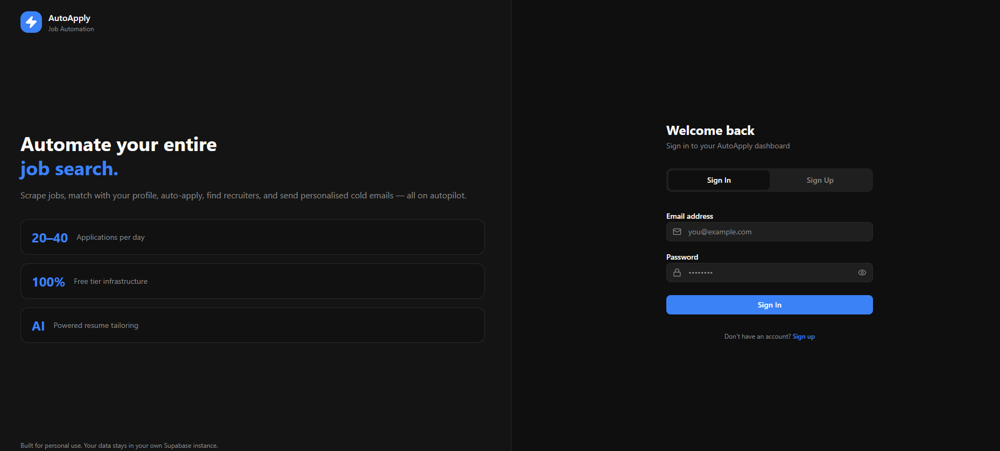
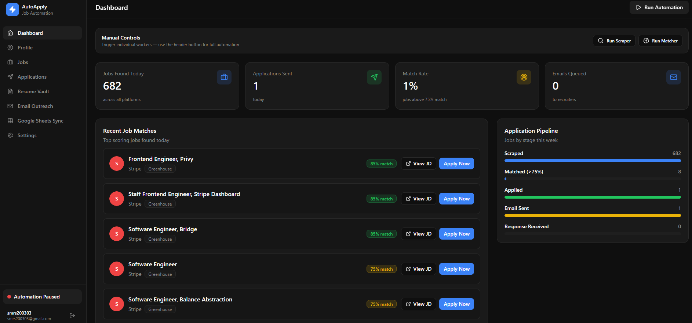
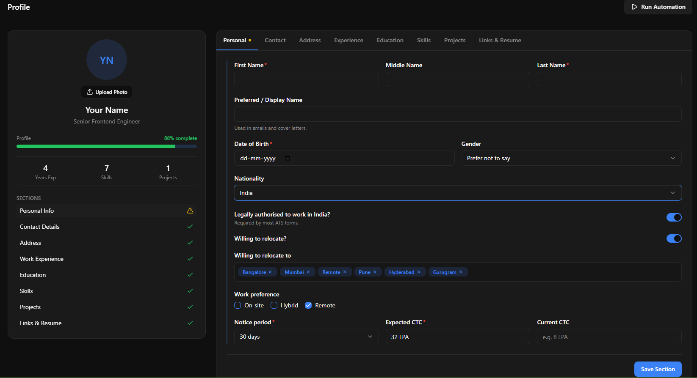
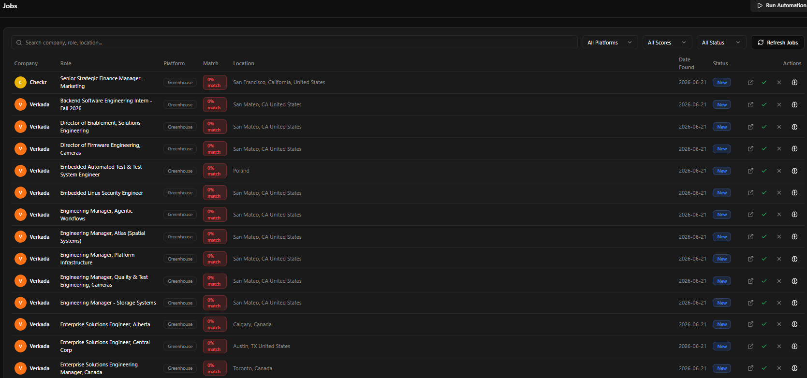
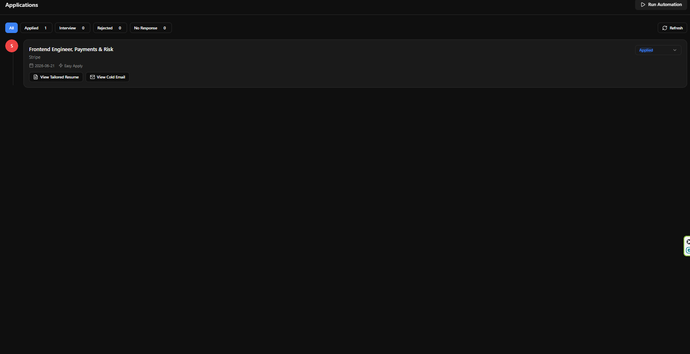
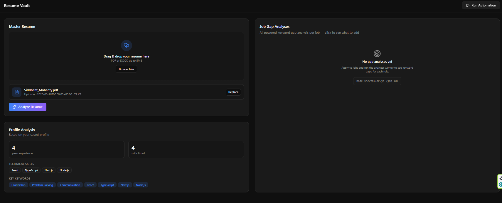
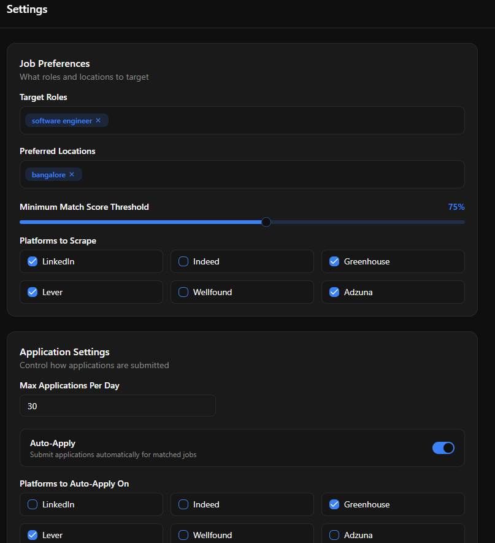

<div align="center">

# ⚡ AutoApply

### Automate your entire job search — scrape, match, apply, and track. All on autopilot.

[](https://job-application-automation-u4ci.onrender.com)
[](#-tech-stack)
[](#-tech-stack)

<br/>

[**Live Demo**](https://job-application-automation-u4ci.onrender.com) · [Features](#-features) · [Architecture](#-architecture) · [Getting Started](#-getting-started) · [Roadmap](#-roadmap)

</div>

<br/>

## 📋 Overview

**AutoApply** is a personal job-search automation platform built for one purpose: stop wasting hours manually searching job boards, copy-pasting resumes, and tracking applications in spreadsheets.

It scrapes jobs from real company career pages, scores every listing against your actual profile using AI, surfaces a keyword gap analysis so you know exactly what to improve before applying, and keeps a live dashboard of your entire pipeline — from "found" to "interview."

Built end-to-end as a **multi-tenant, production-deployed application** — anyone can sign up, build their own profile, and run their own personalized automation pipeline with complete data isolation between accounts.

<br/>

## ✨ Features

<table>
<tr>
<td width="50%" valign="top">

### 🔍 Smart Job Discovery
Pulls live listings from Greenhouse and Lever career APIs, Adzuna, and Indeed RSS — filtered per-user against your own target roles and preferred locations. No two users see the same feed.

### 🧠 AI-Powered Matching
Every job is scored 0–100% against your real experience, skills, and projects using OpenAI — not keyword stuffing, actual contextual matching.

### 📄 Resume Gap Analysis
For any job, get an instant breakdown of missing keywords, missing skills, and prioritized suggestions to strengthen your application — you stay in control of your resume, the AI just tells you what to fix.

</td>
<td width="50%" valign="top">

### 📊 Live Application Pipeline
Track every application from Scraped → Matched → Applied → Interview on a real-time dashboard with activity logs, metrics, and a weekly trend chart.

### 🔐 True Multi-Tenancy
Full Supabase Auth + Row Level Security. Every user's jobs, applications, profile, resumes, and settings are completely isolated — built to support real concurrent users, not just a single account.

### 🎛️ One-Click Automation
Trigger the scraper, matcher, or gap analyzer directly from the dashboard. A background worker service runs the full pipeline independent of whether you're online.

</td>
</tr>
</table>

<br/>

## 🖥️ Screens

<table>
<tr>
<td width="50%"></td>
<td width="50%"></td>
</tr>
<tr>
<td align="center"><b>Sign In</b> — secure auth with full data isolation per account</td>
<td align="center"><b>Dashboard</b> — live metrics, pipeline, activity log</td>
</tr>
<tr>
<td width="50%"></td>
<td width="50%"></td>
</tr>
<tr>
<td align="center"><b>Profile</b> — full professional profile builder</td>
<td align="center"><b>Jobs</b> — filterable, AI-scored job table</td>
</tr>
<tr>
<td width="50%"></td>
<td width="50%"></td>
</tr>
<tr>
<td align="center"><b>Applications</b> — status timeline tracker</td>
<td align="center"><b>Resume Vault</b> — AI keyword gap analysis</td>
</tr>
<tr>
<td width="50%"></td>
<td width="50%"></td>
</tr>
<tr>
<td align="center"><b>Settings</b> — preferences, thresholds, API keys</td>
<td></td>
</tr>
</table>
<br/>

## 🏗️ Architecture

```
┌─────────────────────┐         ┌──────────────────────┐
│   Frontend (React)   │ ◄─────► │  Workers (Node.js)    │
│   TanStack Router     │  REST   │  Express API server   │
│   Deployed on Render  │         │  Deployed on Render    │
└──────────┬───────────┘         └───────────┬───────────┘
           │                                  │
           │         ┌─────────────┐          │
           └────────►│  Supabase    │◄─────────┘
                     │  PostgreSQL  │
                     │  Auth + RLS  │
                     │  Storage     │
                     └─────────────┘
                            ▲
                            │
                  ┌─────────┴──────────┐
                  │   OpenAI API        │
                  │   (matching, gap     │
                  │    analysis)         │
                  └────────────────────┘
                            ▲
                            │
        ┌───────────────────┼───────────────────┐
        │                   │                    │
  Greenhouse API        Lever API           Adzuna / Indeed RSS
```

**Monorepo structure:**

```
job-automation/
├── frontend/              # React 19 + TanStack Router SPA
│   ├── src/
│   │   ├── components/    # UI components (jobs, profile, dashboard, resume vault...)
│   │   ├── context/       # Auth, Profile, Automation state
│   │   ├── lib/           # Supabase client + API layer per domain
│   │   └── routes/        # File-based routing
│   └── server-prod.js     # Production static server
│
└── workers/               # Node.js background automation
    └── src/
        ├── scraper.js     # Personalized multi-source job scraper
        ├── matcher.js     # OpenAI-based JD matching engine
        ├── tailor.js      # Resume gap analyzer
        ├── server.js      # Express API — trigger endpoints
        └── index.js       # Entry point + cron scheduler
```

<br/>

## 🛠️ Tech Stack

<div align="center">

| Layer | Technology |
|---|---|
| **Frontend** | React 19 · TanStack Router · TanStack Query · Tailwind CSS · shadcn/ui |
| **Backend / Workers** | Node.js · Express · node-cron |
| **Database & Auth** | Supabase (PostgreSQL, Row Level Security, Storage) |
| **AI** | OpenAI `gpt-4o-mini` |
| **Job Sources** | Greenhouse API · Lever API · Adzuna API · Indeed RSS |
| **Deployment** | Render (frontend + workers as independent services) |

</div>

<br/>

## 🔒 Security & Data Isolation

This isn't a single-user script — it's built as a real multi-tenant application:

- **Row Level Security (RLS)** enforced on every table — users can only ever read or write their own rows, verified at the database layer, not just the application layer.
- **Per-user job scraping** — each account's scrape is filtered against their own target roles and settings; no shared data leaks between accounts.
- **Authenticated worker calls** — every automation trigger from the frontend carries the user's Supabase session token, which the worker validates before acting on their behalf.
- **Storage isolation** — resumes are stored in user-scoped paths within private Supabase Storage buckets.

<br/>

## 🚀 Getting Started

### Prerequisites

- Node.js 18+
- A [Supabase](https://supabase.com) project
- An [OpenAI](https://platform.openai.com) API key

### 1. Clone the repo

```bash
git clone https://github.com/siddhantmohanty20/Job-Application-Automation
cd Job-Application-Automation
```

### 2. Set up the database

Run the schema in `schema.sql` against your Supabase project via the SQL Editor. This provisions all tables, indexes, RLS policies, and storage buckets.

### 3. Configure environment variables

**`frontend/.env.local`**
```env
VITE_SUPABASE_URL=your-supabase-url
VITE_SUPABASE_ANON_KEY=your-anon-key
VITE_WORKER_URL=http://localhost:3001
VITE_WORKER_API_KEY=your-shared-secret
```

**`workers/.env`**
```env
SUPABASE_URL=your-supabase-url
SUPABASE_SERVICE_ROLE_KEY=your-service-role-key
OPENAI_API_KEY=your-openai-key
WORKER_API_KEY=your-shared-secret
FRONTEND_URL=http://localhost:5173
```

### 4. Install and run

```bash
# Frontend
cd frontend
npm install --legacy-peer-deps
npm run dev

# Workers (separate terminal)
cd workers
npm install
node src/index.js
```

Open `http://localhost:5173`, sign up, complete your profile, and click **Run Automation**.

<br/>

## 🗺️ Roadmap

- [ ] Cold email outreach — recruiter discovery + Gmail API + rate-limited sending queue
- [ ] Google Sheets live sync for application tracking
- [ ] Scraping relevance tuning — tighter role-matching heuristics
- [ ] Browser extension for one-click ATS auto-fill using saved profile data
- [ ] Custom domain + production hardening

<br/>

## 📄 License
  
  This is a personal project, not currently licensed for reuse.
<br/>

<div align="center">

Built by **Siddhant Mohanty**

[](https://github.com/siddhantmohanty20)
[](https://www.linkedin.com/in/siddhant-mohanty-132a02257/)
[](https://www.siddhantmohanty.in/)

</div>